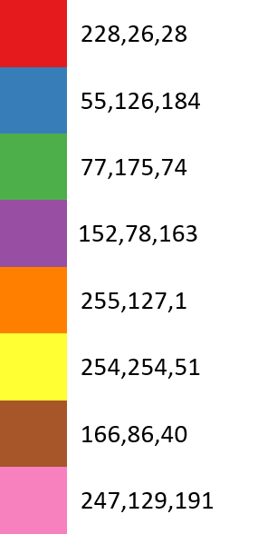
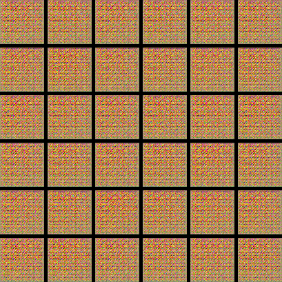
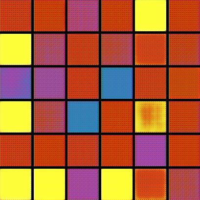
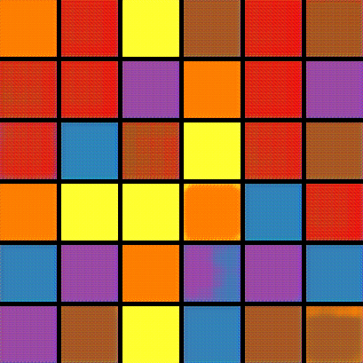
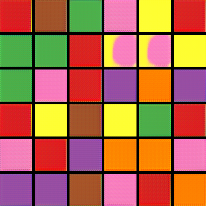
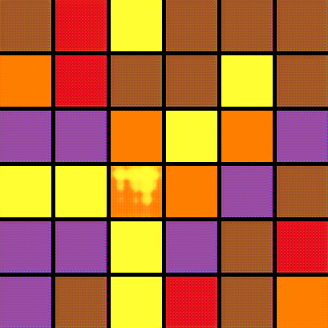

# SNGAN Color Overfit

This is a simple GAN setup with spectral normalization using `Python 3.7` and `PyTorch 1.3`.

The real data is a 64x64 image chosen from 1 of 8 colors.

## Input data
Real data are solid colors from a qualitative color map from [ColorBrewer](https://colorbrewer2.org/#type=qualitative&scheme=Set1&n=8).



## Training
`
python train.py --gpu 0 --output_path "<output_path>"
`

## Loss outputs
```
   10:	Loss(G): 0.6861	Loss(D): 0.6998	Real Pred.: 0.4968	Fake Pred.: 0.5034
   20:	Loss(G): 0.6948	Loss(D): 0.7061	Real Pred.: 0.4866	Fake Pred.: 0.4992
   30:	Loss(G): 0.6939	Loss(D): 0.6945	Real Pred.: 0.4983	Fake Pred.: 0.4996
   40:	Loss(G): 0.6676	Loss(D): 0.7009	Real Pred.: 0.5055	Fake Pred.: 0.5130
   50:	Loss(G): 0.6639	Loss(D): 0.7119	Real Pred.: 0.4964	Fake Pred.: 0.5148
   60:	Loss(G): 0.6232	Loss(D): 0.7265	Real Pred.: 0.5059	Fake Pred.: 0.5362
   70:	Loss(G): 0.7260	Loss(D): 0.6849	Real Pred.: 0.4924	Fake Pred.: 0.4838
   80:	Loss(G): 0.6976	Loss(D): 0.6964	Real Pred.: 0.4952	Fake Pred.: 0.4978
   90:	Loss(G): 0.8104	Loss(D): 0.6286	Real Pred.: 0.5151	Fake Pred.: 0.4447
  100:	Loss(G): 0.8660	Loss(D): 0.6519	Real Pred.: 0.4738	Fake Pred.: 0.4207
```

## Image outputs
 Iteration | Output 
--- | ---
00100 | 
02500 | 
05000 | 
07500 | 
10000 | 